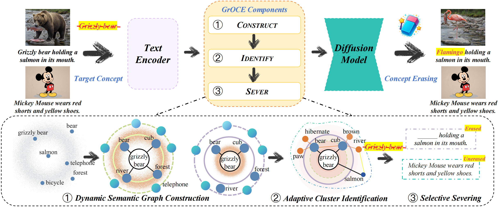

# [CVPR 2026 Highlight 🔥] GrOCE  : Graph-Guided Online Concept Erasure for Text-to-Image Diffusion Models

**Paper:** [Arxiv](Arxiv)

**Authors:** Ning Han, Zhenyu Ge, Feng Han, Yuhua Sun, Jingjing Chen



**GrOCE** performs inference-time concept erasure through three synergistic components: (1) **Dynamic Semantic Graph Construction** builds a semantic graph with vocabulary tokens as nodes and cosine-weighted edges, supporting incremental updates for evolving concept sets.(2) **Adaptive Cluster Identification** performs multi-hop traversal with similarity decay to identify semantically entangled concepts (e.g., “grizzly,” “panda”) around the target. (3) **Selective Severing** removes the semantic components associated with the identified cluster, editing the text prompt prior to diffusion to suppress target concepts while preserving non-target semantics.

## 📣 News

- 2026/04 🌟 Our paper is selected as a CVPR 2026 Highlight (top 5% of submissions).
- 2026/03 🎉 Our paper is accepted to CVPR 2026.


## 🛠️ Environment Configuration


```bash
# create conda environment
conda create -n GrOCE -y python=3.11
conda activate GrOCE
cd GrOCE
# install pytorch
pip install torch torchvision torchaudio --index-url https://download.pytorch.org/whl/cu118
# install other dependencies
pip install -r requirements.txt
```


## 🧹 GrOCE Concept Erasure

### Establishment of the Graph

Build the semantic concept graph to provide the basic semantic structure for subsequent concept erasure.

```bash
python knowledge.py
```

### Generate Erased Images

Generate images with target concepts erased using pre-trained models and concept graphs.

```bash
python sample_erase.py \
  --save_root "./logs" \
  --sd_ckpt "CompVis/stable-diffusion-v1-4" \
  --mode "edit" \
  --target_concepts "Snoopy" \
  --prompts "A blonde Snoopy with blue eyes sits lazily on the golden, fine sand of the beach." \
  --erase_type "instance" \
  --projection_threshold 5
  --network_path "./concept_network_results/concept_network.json"
```

## 📈 GrOCE Metrics Evaluation

### Establishment of the Graph

Build the semantic concept graph for metrics evaluation.

```bash
python knowledge.py
```

### Generate Original Images

Generate original images without concept erasure as the baseline.

```bash
bash scripts/origin.sh
```

### Generate Erased Images

Generate images with concept erasure for comparative evaluation.

```bash
bash scripts/erase.sh
```
## 📝 Citation 

If you use this code in your research, please cite our paper:

```bibtex

```

## 🙏 Acknowledgments

We thank the authors of [SPEED](https://github.com/Ouxiang-Li/SPEED) as part of our code is derived from their work.